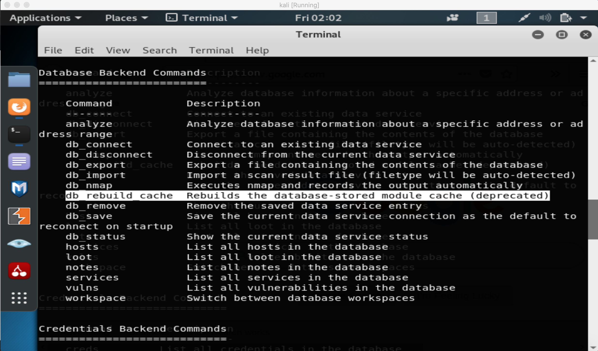
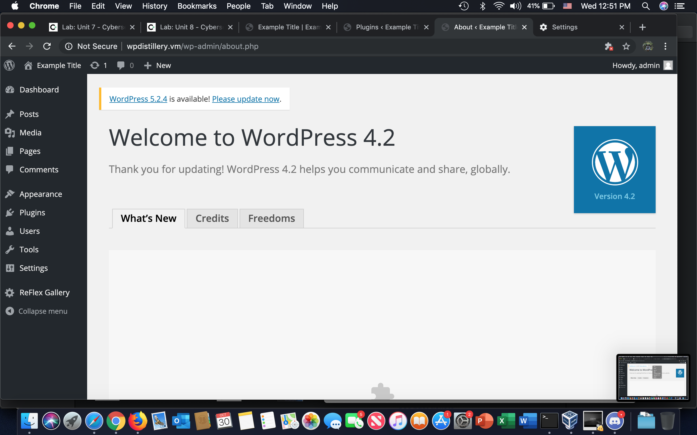
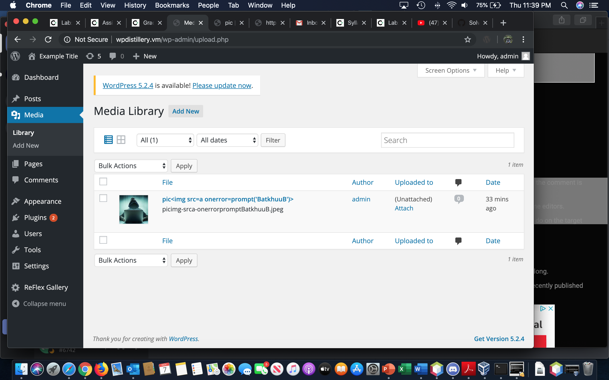
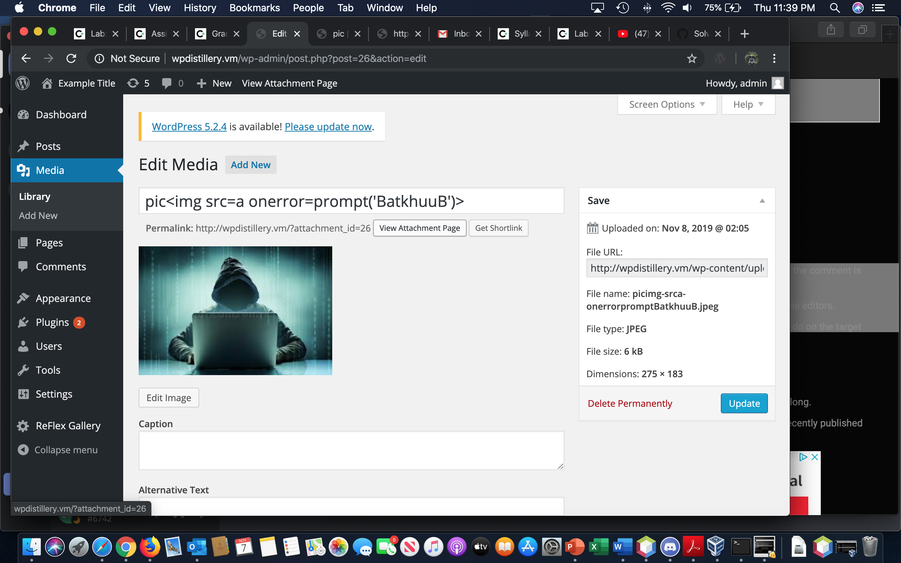
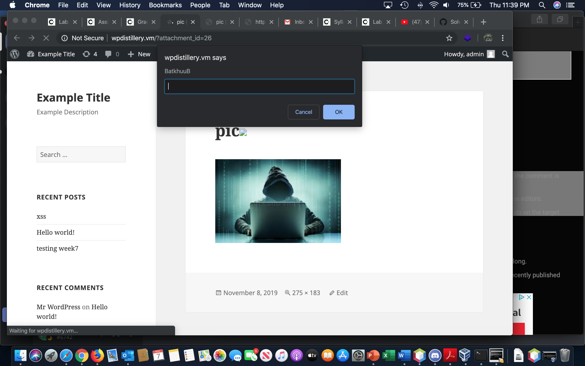

# CodePath-Week7
Trying to exploit WPDistillery 

# Overview

WordPress 4.2 version is vulnerable to a stored XSS. An unauthenticated attacker can inject JavaScript in WordPress . The script is triggered when the attachment is viewed. If triggered by a logged-in administrator, under default settings the attacker could change the administrator’s password, create new administrator accounts, or do whatever else the currently logged-in administrator can do on the target system.

# Week 7 

i was followed all steps through week 7 lab exercises and confront some difficulty and most challinging was challange 5.
Problem was on vm i can get respond from ping 192.168.33.10 but cant get any respond run wpscan --url http://wpdistillery.vm --random-user-agent unfortunately i forgot to document that part. 

# Week 8

On week 8 i was only able to go through half of milestone 4 because my metasploit version is 5 and some of commands are deprecated.

So i found only one vulnerability based on what i learned previous classes.

# Walkthrough:

First thing is check version of wpdistillery.vm

Then upload a picture(renamed with xss)

Now that post contain xss and if open attached file it will prompt 

